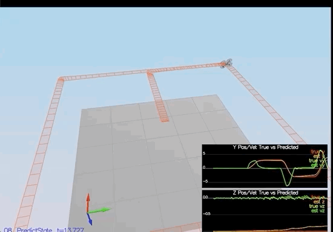
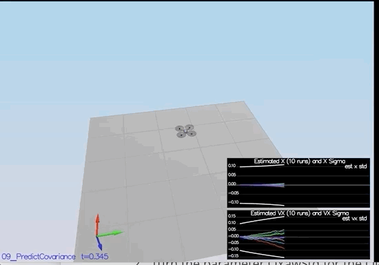
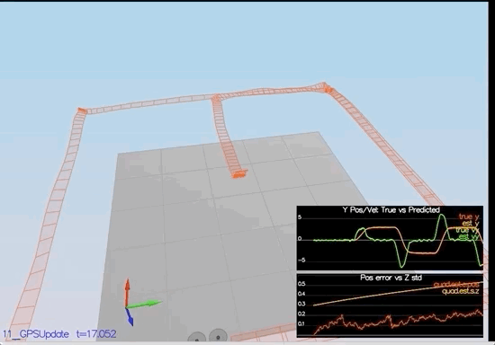

# Step 1: Sensor Noise 

1. Run the simulator in the same way as you have before. (Be sure to include the current project directory, otherwise the scenario will not be loaded)

2. Choose Scenario 06_NoisySensors. 

3. Process the logged files to get the standard deviation of the GPS X signal and the IMU Accelerometer X signal. 

4. Insert the result into the top of config/6_Sensornoise.txt. Setting the values for 'MeasuredStdDev_GPSPoxXy' and 'MeasuredStdDev_AccelXy'

5. Run the simulator. The dashed line in the simulation turned green. Capturing approximately 68% of the respective measurements.

   Success Criteria: Standard deviations should accurately capture the value of of approximately 68% of the respective measurements. 

   ```
   Simulation #3 (../config/06_SensorNoise.txt)
   
   PASS: ABS(Quad.GPS.X-Quad.Pos.X) was less than MeasuredStdDev_GPSPosXY for 68% of the time
   
   PASS: ABS(Quad.IMU.AX-0.000000) was less than MeasuredStdDev_AccelXY for 68% of the time
   ```


   <p align="center">
   
   </p>

   

# Step 2: Attitude Estimation 

This step, the goal is to improve the **complementary filter-type attitude filter** with a better rate gyro attitude integration scheme. 

1. Run **07_AttitudeEstimation**. Only sensor used is the IMU and noise levels are set to 0. 2 plots in this simulation(1. errors in each of the estimated Euler angles. 2. True euler angles and the estimates.)
2. In QuadEstimatorEKF.cpp, implement a better rate gyro attitude integration scheme to reduce the attitude errors to get within 0.1 rad for each Euler angles 

Success Criteria: Attitude estimator needs to get within 0.1 rad for each of the Euler angles for at least 3 seconds. 

```
Simulation #12 (../config/07_AttitudeEstimation.txt)**

**PASS: ABS(Quad.Est.E.MaxEuler) was less than 0.100000 for at least 3.000000 seconds**
```

   <p align="center">
   
   </p>


# Step 3: Prediction Step

Implementing the prediction step of the filter. 

1. Run scenario **08_PredictState**. This scenario only uses a perfect IMU. Plots on this simulation show element of estimated state and that of the true state. 

2. In QuadEsstimatorEKF.cpp, implement the state prediction step in the PredictState() function. Below is a demonstration of how the estimator state tracks the actual state, with reasonably drift.

3. Introducing a realistic IMU with noise. Run 09_PredictionCov, will provide a fleet of quad using the prediction code to integrate forward. 

4. In QuadEstimatorEKF.cpp, calculate the partial derivative of the body-to-global rotation matrix in the function GetRbgPrime(). Also implement the prediction step(predict the state convariance forward) in Predict()

5. Run covariance prediction and tune QPosXYStd adn QVelXyStd parameters in QuadEstimatorEKF.txt to capture the magniture of the error. 

6. See screenshots and demos below

   <p align="center">
   
   </p>

   <p align="center">
   
   </p>


# Step 4: Magnetometer Update

Until now, we have only used the accelerometer and gyro for state estimation. 

This step 4, will add the information from the magnetometer to improve filter's performance in estimating the vehicle's reading. 

1. Run scenario 10_MagUpdate. This scenario uses a realistic IMU, but hasn't incorporated the magnetometer udpate. As a result, the estimate yaw is drift away from the real value(and the estimated standard deviation will also be increasing). 

2. Turn the parameter QYawStd for the QuadEstimatorEKF so that it approximately captures the magniture of the drift. 

3. Implement Magnetometer update in the function UpdateFromMag (). See resulting plots. 

   Success Criteria: Have an estimate standard deviation that captures the error and maintain an error of less than 0.1 rad in heading for at least 10 seconds of the simulation. 

   ```
   **Simulation #45 (../config/10_MagUpdate.txt)**
   
   **PASS: ABS(Quad.Est.E.Yaw) was less than 0.120000 for at least 10.000000 seconds**
   
   **PASS: ABS(Quad.Est.E.Yaw-0.000000) was less than Quad.Est.S.Yaw for 70% of the time**
   ```

   <p align="center">
   
   </p>

   

   

# Step 5: Closed Loop + GPS Update

1. Run scenario `11_GPSUpdate`. At the moment this scenario is using both an ideal estimator and and ideal IMU. Even with these ideal elements, watch the position and velocity errors (bottom right). As you see they are drifting away, since GPS update is not yet implemented.
2. Let's change to using your estimator by setting `Quad.UseIdealEstimator` to 0 in `config/11_GPSUpdate.txt`. Rerun the scenario to get an idea of how well your estimator work with an ideal IMU.
3. Now repeat with realistic IMU by commenting out these lines in `config/11_GPSUpdate.txt`:

```
#SimIMU.AccelStd = 0,0,0
#SimIMU.GyroStd = 0,0,0
```

1. Tune the process noise model in `QuadEstimatorEKF.txt` to try to approximately capture the error you see with the estimated uncertainty (standard deviation) of the filter.
2. Implement the EKF GPS Update in the function `UpdateFromGPS()`.
3. Now once again re-run the simulation. Your objective is to complete the entire simulation cycle with estimated position error of < 1m (you’ll see a green box over the bottom graph if you succeed). You may want to try experimenting with the GPS update parameters to try and get better performance.

***Success criteria:*** *Your objective is to complete the entire simulation cycle with estimated position error of < 1m.

   <p align="center">
   
   </p>


# Step 6: Adding my controller 

1. Run scenario `11_GPSUpdate`. At the moment this scenario is using both an ideal estimator and and ideal IMU. Even with these ideal elements, watch the position and velocity errors (bottom right). As you see they are drifting away, since GPS update is not yet implemented.
2. Let's change to using your estimator by setting `Quad.UseIdealEstimator` to 0 in `config/11_GPSUpdate.txt`. Rerun the scenario to get an idea of how well your estimator work with an ideal IMU.
3. Now repeat with realistic IMU by commenting out these lines in `config/11_GPSUpdate.txt`:

```
#SimIMU.AccelStd = 0,0,0
#SimIMU.GyroStd = 0,0,0
```

1. Tune the process noise model in `QuadEstimatorEKF.txt` to try to approximately capture the error you see with the estimated uncertainty (standard deviation) of the filter.

2. Implement the EKF GPS Update in the function `UpdateFromGPS()`.

3. Now once again re-run the simulation. Your objective is to complete the entire simulation cycle with estimated position error of < 1m (you’ll see a green box over the bottom graph if you succeed). You may want to try experimenting with the GPS update parameters to try and get better performance.

   ```
   **Simulation #47 (../config/11_GPSUpdate.txt)**
   
   **PASS: ABS(Quad.Est.E.Pos) was less than 1.000000 for at least 20.000000 seconds**
   ```

   

***Success criteria:*** *Your objective is to complete the entire simulation cycle with estimated position error of < 1m.*

